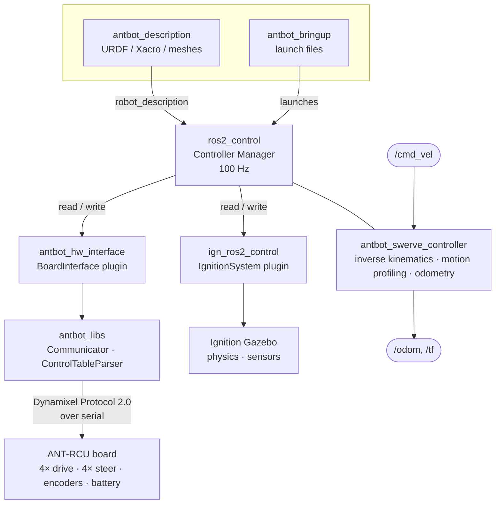
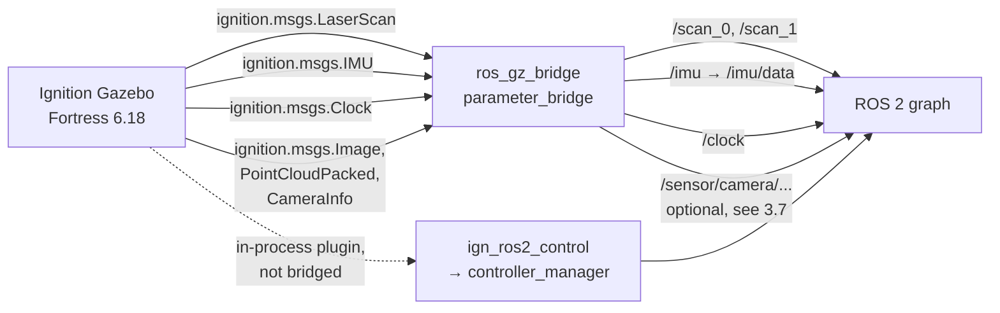

# AntBot on Jetson — Docker + Gazebo Tutorial

How to build and run the AntBot ROS 2 Humble workspace inside Docker on this
Jetson, how to drive the robot in Ignition Gazebo, and how the software fits
together.

Everything below was verified on this machine, not copied from upstream docs.
Where this setup deviates from the upstream `antbot` README, the reason is
stated — the deviations are all consequences of running on **arm64**.

---

## 0. The machine

| | |
|:--|:--|
| Board | Jetson AGX Thor devkit |
| L4T | R38.4 (JetPack 7) |
| Host OS | Ubuntu 24.04 (noble), aarch64 |
| Kernel | 6.8.12-tegra |
| Docker | 29.8.0 + compose v5.5.1, `nvidia` runtime registered |
| GPU in container | NVIDIA Tegra Thor/PCIe, OpenGL 4.6, driver 580.00 |

### Why Docker at all

ROS 2 Humble targets **Ubuntu 22.04 (jammy)**. This host runs **24.04
(noble)**. There is no Humble apt repository for noble, so Humble cannot be
installed natively here. The container supplies a jammy userspace while still
using the host's kernel and GPU.

---

## 1. Docker

### 1.1 Layout

```
ros2_humble_ws/
├── docker/
│   ├── Dockerfile           # the image definition
│   ├── docker-compose.yml   # how the container is run (GPU, X11, mounts)
│   ├── run.sh               # thin wrapper: build / up / shell / down / logs
│   ├── entrypoint.sh        # sources ROS before handing off to your command
│   └── README.md            # design notes for the container itself
├── src/                     # ROS 2 packages (mounted into the container)
├── build/  install/  log/   # colcon output (created on first build)
├── tutorial.md              # this file
└── simulation.md            # running the simulator: sensors, worlds, Nav2
```

The **whole workspace** is bind-mounted into the container at the same path it
has on the host (`/home/dogu/ros2_humble_ws`). Two consequences:

- `build/`, `install/` and `log/` persist on the host. Destroying the container
  does not cost you a rebuild.
- The container user is `dogu`, uid 1000, gid 1000 — the same as yours. Files
  colcon writes into the mount stay owned by you, not by root.

### 1.2 Daily commands

```bash
cd ~/ros2_humble_ws/docker

./run.sh build     # rebuild the image (only after editing the Dockerfile)
./run.sh up        # start the container in the background
./run.sh shell     # start it if needed, then open a shell inside
./run.sh down      # stop and remove it
./run.sh logs      # follow container output
```

`./run.sh shell` is the one you want almost always.

### 1.3 What the container gives you

| feature | how |
|:--|:--|
| Hardware OpenGL | `runtime: nvidia` bind-mounts the L4T driver stack, so rviz2 and Gazebo render on the GPU |
| GUI apps | `/tmp/.X11-unix` + an X cookie at `~/.docker.xauth`; `DISPLAY` is passed through |
| DDS on the LAN | `network_mode: host` — nodes inside behave like native ones |
| Shared memory | `ipc: host` — needed for large messages and X shared pixmaps |
| SSH keys | `~/.ssh` mounted read-only |

### 1.4 Sourcing: interactive vs. scripted

`~/.bashrc` sources ROS **and** the workspace overlay, but Ubuntu's `.bashrc`
returns early for non-interactive shells. So:

```bash
# Interactive — everything is already sourced, aliases work
./run.sh shell
ros2 topic list

# Scripted — you must source explicitly
docker compose exec ros2_humble bash -c \
  'source /opt/ros/humble/setup.bash && \
   source ~/ros2_humble_ws/install/setup.bash && ros2 topic list'
```

`docker compose exec` also bypasses `entrypoint.sh`, which is the other half of
the reason scripted one-liners need explicit sourcing.

### 1.5 Shell aliases (interactive only)

| alias | expands to |
|:--|:--|
| `rdep` | `rosdep install --from-paths src --ignore-src -r -y` |
| `rbuild` | `colcon build --symlink-install` |
| `rsource` | `source install/setup.bash` |
| `rtest` | `colcon test && colcon test-result --verbose` |
| `rclean` | `rm -rf build install log` |

---

## 2. Building the workspace

### 2.1 Dependencies are baked into the image

The upstream flow is `scripts/setting.sh` → `rosdep install` → `colcon build`.
On this setup **`rosdep` is already satisfied**: every package it resolves is
installed at image-build time in `docker/Dockerfile` (steps 4b and 4c).

This is deliberate. A container is disposable. Anything `rosdep` installs into
a *running* container disappears on the next `./run.sh down`, and the workspace
then silently stops building. Baking the list into the image makes the
environment reproducible.

> **If you add a package to `src/`** that needs a new system dependency, run
> `rdep` inside the container to get going immediately — then add the package
> to step 4c of the Dockerfile so it survives the next `down`.

### 2.2 Build

```bash
./run.sh shell
colcon build --symlink-install       # or: rbuild
source install/setup.bash            # or: rsource
```

A clean build of all 31 packages takes roughly **5–6 minutes** on this Jetson
(12 cores). Incremental builds are seconds.

`--symlink-install` symlinks Python files and config into `install/` instead of
copying, so editing a launch file or YAML takes effect without rebuilding.

### 2.3 What is in `src/`

| repo | what it is |
|:--|:--|
| `antbot/` | the robot: 12 packages, tracked against upstream |
| `ublox/` | u-blox GNSS driver |
| `DynamixelSDK/` | Dynamixel Protocol 2.0 SDK |
| `coin_d4_driver/` | 2D lidar driver |
| `OrbbecSDK_ROS2/` | Orbbec RGB-D camera driver |
| `ros_gz/` | **Gazebo bridge — built from source, see §3.1** |
| `gz_ros2_control/` | **Gazebo ros2_control plugin — built from source, see §3.1** |

The first four come from `antbot/additional_repos.repos`. The last two are
specific to this arm64 setup.

---

## 3. Gazebo simulation

> Cameras are covered in §3.7. For every simulated sensor topic, the frame
> conventions and the sim performance budget, see
> [`simulation.md`](simulation.md). This section covers the basics only.

### 3.1 Why two packages are built from source

`packages.ros.org` publishes **no arm64 build** of `ros_gz_*` or
`ign_ros2_control`. That is why upstream's `setting.sh` passes
`--skip-keys "ros_gz_sim ros_gz_bridge ign_ros2_control ignition-fortress"`.

However — Ignition itself is a different matter. **OSRF publishes
`ignition-fortress` for arm64/jammy from its own repository**, so the simulator
runs here perfectly well. Only the ROS-side bridges are missing, and those
compile from source in about 2.5 minutes.

So the image installs Fortress from OSRF, and `src/` carries:

- `gazebosim/ros_gz` (branch `humble`) → `ros_gz_sim`, `ros_gz_bridge`, `ros_gz_image`, `ros_gz_interfaces`
- `ros-controls/gz_ros2_control` (branch `humble`) → the `IgnitionSystem` hardware plugin

**A naming subtlety worth knowing.** On the `humble` branch, the package named
`ign_ros2_control` is an empty shim. The real plugin is built by
`gz_ros2_control`, which installs *both* library names and registers the
backward-compatible aliases the URDF asks for:

| what the URDF references | where it actually comes from |
|:--|:--|
| `libign_ros2_control-system.so` | `install/gz_ros2_control/lib/` |
| `ign_ros2_control::IgnitionROS2ControlPlugin` | alias via `IGNITION_ADD_PLUGIN_ALIAS` |
| `ign_ros2_control/IgnitionSystem` | alias in `gz_hardware_plugins.xml` |

Because that `.so` lives in the workspace overlay rather than
`/opt/ros/humble/lib` — which is what `gazebo.launch.py` hardcodes —
`docker-compose.yml` sets:

```
IGN_GAZEBO_SYSTEM_PLUGIN_PATH=/home/dogu/ros2_humble_ws/install/gz_ros2_control/lib
```

The launch file *appends* to this variable rather than overwriting it, so
setting it in the environment is what lets Ignition find the plugin. **Without
it the simulation starts but no controller ever loads** — a confusing failure,
because Gazebo itself looks healthy.

### 3.2 Run it

```bash
./run.sh shell
ros2 launch antbot_gazebo gazebo.launch.py world:=depot
```

The Ignition GUI opens on your display. Press the **▶ play** button (or launch
with `-r`, which this launch file already does) to start the physics clock.

### 3.3 Choose a world — and mind the default

```bash
ros2 launch antbot_gazebo gazebo.launch.py world:=depot   # warehouse, full sensors
ros2 launch antbot_gazebo gazebo.launch.py world:=empty   # flat ground plane
ros2 launch antbot_gazebo gazebo.launch.py world:=/abs/path/to/custom.sdf
```

The 3D LiDAR and the cameras are off by default and enabled with
`lidar_3d:=true`, `camera:=true`, `side_cameras:=true` and
`mono_cameras:=true`; `headless:=true` runs the server without the GUI.
See §3.7 below and [`simulation.md`](simulation.md) §2–§3.

> ### ⚠️ Any world you write needs the sensor system plugins
>
> Ignition loads only its default systems (Physics, UserCommands,
> SceneBroadcaster) — the **`Sensors` system is not a default**. Without it,
> `gpu_lidar` and IMU sensors are never rendered, so `/scan_0`, `/scan_1` and
> `/imu/data` stay silent even though the robot drives correctly.
>
> `worlds/empty.sdf` originally declared **no `<plugin>` elements at all** and
> was silent for this reason. It now carries the same full set as
> `worlds/depot.sdf`:
>
> ```xml
> <plugin filename="libignition-gazebo-physics-system.so"           name="ignition::gazebo::systems::Physics"/>
> <plugin filename="libignition-gazebo-sensors-system.so"           name="ignition::gazebo::systems::Sensors">
>   <render_engine>ogre2</render_engine>
> </plugin>
> <plugin filename="ignition-gazebo-imu-system"                     name="ignition::gazebo::systems::Imu"/>
> <plugin filename="libignition-gazebo-user-commands-system.so"     name="ignition::gazebo::systems::UserCommands"/>
> <plugin filename="libignition-gazebo-scene-broadcaster-system.so" name="ignition::gazebo::systems::SceneBroadcaster"/>
> ```
>
> Both shipped worlds now publish sensors. Copy those five blocks into any
> world of your own. `ogre2` is not optional: under the older `ogre` engine
> every `gpu_lidar` ray returns `range_min`.

### 3.4 Drive the robot

```bash
# straight ahead at 0.4 m/s
ros2 topic pub -r 20 /cmd_vel geometry_msgs/msg/Twist "{linear: {x: 0.4}}"

# strafe sideways — swerve drive is omnidirectional
ros2 topic pub -r 20 /cmd_vel geometry_msgs/msg/Twist "{linear: {y: 0.3}}"

# rotate in place
ros2 topic pub -r 20 /cmd_vel geometry_msgs/msg/Twist "{angular: {z: 0.5}}"

# or use the keyboard
ros2 run antbot_teleop teleop_keyboard

# joystick, simulation variant (sets use_sim_time)
ros2 launch antbot_teleop teleop_joy_sim.launch.py
```

`antbot_teleop` also ships `swerve_sim`, a standalone visualiser for the swerve
inverse kinematics that needs no Gazebo at all:
`ros2 run antbot_teleop swerve_sim`

Watch the result:

```bash
ros2 topic echo /odom
ros2 control list_controllers
```

### 3.5 Expected healthy output

| check | expected |
|:--|:--|
| `ros2 control list_controllers` | `joint_state_broadcaster` **active**, `antbot_swerve_controller` **active** |
| `ros2 topic hz /scan_0` | ~15 Hz (matches `<update_rate>15</update_rate>`) |
| `ros2 topic hz /scan_1` | ~15 Hz |
| `ros2 topic hz /imu/data` | ~100 Hz |
| `ros2 topic echo /clock` | seconds advancing |
| `/cmd_vel 0.4 m/s` for 5 s | `/odom` position x ≈ 2 m |

> **Measuring rates:** stale nodes from a previous run will inflate these
> numbers, because `network_mode: host` means every run shares
> `ROS_DOMAIN_ID=0`. If a rate looks wrong, kill leftovers first:
> `pkill -9 -f "ign gazebo"; pkill -9 -f "ros2 launch"`

### 3.6 Simulation vs. real robot

The same controller drives both; only the hardware interface swaps out.

| | real robot | simulation |
|:--|:--|:--|
| launch | `antbot_bringup bringup.launch.py` | `antbot_gazebo gazebo.launch.py` |
| hardware plugin | `antbot_hw_interface/BoardInterface` | `ign_ros2_control/IgnitionSystem` |
| controller config | `antbot_bringup/config/` | `antbot_gazebo/config/swerve_controller_gazebo.yaml` |
| lidar topics | `/sensor/lidar_2d_{front,back}/scan` | `/scan_0`, `/scan_1` |
| IMU topic | `/imu/accel_gyro` | `/imu/data` |
| RGBD cameras | `/sensor/camera/stereo_{front,left,right,back}/*` | same names (`camera:=true`, `side_cameras:=true`) |
| mono cameras | `/sensor/camera/v4l2_driver/<position>/*` | same names (`mono_cameras:=true`) |
| time source | wall clock | `/clock`, `use_sim_time: true` |

The sim controller config disables the acceleration command interface, which
`IgnitionSystem` does not implement. The warning
`Wheel acceleration command interface not found for module 0..3` at startup is
expected and harmless.

### 3.7 Cameras

Nine rendering sensors are available, all off by default. Each one is a render
pass every frame, so turn on only what the task needs.

```bash
# front RGBD only — this is what most perception work wants
ros2 launch antbot_gazebo gazebo.launch.py world:=depot camera:=true

# 360 deg depth coverage: all four RGBD cameras
ros2 launch antbot_gazebo gazebo.launch.py world:=depot \
  lidar_3d:=true camera:=true side_cameras:=true

# everything, mono cameras included (RTF drops to ~0.3)
ros2 launch antbot_gazebo gazebo.launch.py world:=depot \
  lidar_3d:=true camera:=true side_cameras:=true mono_cameras:=true
```

| Argument | Cameras | Topics |
|:--|:--|:--|
| `camera:=true` | front RGBD | `/sensor/camera/stereo_front/*` |
| `side_cameras:=true` | left, right, back RGBD | `/sensor/camera/stereo_{left,right,back}/*` |
| `mono_cameras:=true` | front, left, right, back mono | `/sensor/camera/v4l2_driver/<position>/*` |

Each RGBD camera publishes four topics under its prefix — `image_raw`,
`depth/image_raw`, `points` and `camera_info`. The names match the real
drivers, so nothing downstream needs sim-specific topic configuration.

#### What the RGBD sensors model

The four RGBD cameras are configured from the **S10 ToF datasheet**, in
`RgbdCameraSensor` in `antbot_gazebo/urdf/gazebo_plugins.xacro`:

| Datasheet | Simulated as |
|:--|:--|
| ToF 240 x 160, up to 20 fps / typ. 15 | `<image>` 240 x 160, `update_rate` 15 |
| ToF FOV 90° x 60° | `horizontal_fov` = `radians(90)` |
| Range 0.3–8 m @ 90% reflectivity | `<clip>` near 0.3, far 8.0 |
| Depth + RGB output | `rgbd_camera` image + depth streams |

Three datasheet lines **do not survive the translation** into Gazebo. None of
them is a bug; each is a limit of what `rgbd_camera` can express:

- **RGB comes out at 240 x 160, not 1920 x 1080.** A gz `rgbd_camera` renders
  a single image buffer and derives both the colour and the depth stream from
  it, so colour is locked to the ToF resolution. Raising the resolution to the
  RGB figure would multiply the depth cost ~54x for no extra depth. If a task
  needs full-resolution colour, add a `MonoCameraSensor` on the same link and
  let the RGBD sensor carry depth.
- **Vertical FOV is ~67°, not 60°.** Gazebo derives vfov from hfov and the
  image aspect ratio. 240 x 160 is 3:2, so 90° horizontal yields ~67°
  vertical. Pass `height="139"` to `RgbdCameraSensor` for an exact 90° x 60°
  frustum, at the cost of a non-native depth image.
- **The 0.3–3 m low-reflectivity range is not modelled.** Gazebo depth is
  reflectivity-independent, so dark surfaces read out to the full 8 m. Sim
  depth is optimistic against matte-black obstacles.

For the 120° x 80° S10 variant, pass `hfov="${radians(120)}"`.

#### Mount positions

| Camera | frame_id | Looks toward |
|:--|:--|:--|
| `stereo_front` | `camera_stereo_front_depth_link` | +X, 30° down |
| `stereo_left` | `camera_stereo_left_depth_link` | +Y, 30° down |
| `stereo_right` | `camera_stereo_right_depth_link` | -Y, 30° down |
| `stereo_back` | `camera_stereo_back_depth_link` | -X, 30° down |

> ### ⚠️ A camera sensor must mount on the x-forward `*_link`
>
> A Gazebo camera looks down its mount link's **+X** axis. An optical frame's
> +X points to the *right* and its +Z is what points forward, so mounting a
> camera on a `*_optical_link` aims it 90° off to the side. The macros take a
> separate `frame` parameter, so the mount link and the advertised `frame_id`
> can differ — which is exactly what the mono cameras do.
>
> gz-sensors also publishes the RGBD point cloud in that same x-forward camera
> frame, **not** in the REP-103 optical convention. That is why the RGBD
> cameras report `camera_stereo_*_depth_link` and not the `*_optical_link`
> sibling: name the optical frame and the cloud lands rotated in RViz.

> ### ⚠️ The side and rear mounts are nominal, not measured
>
> `stereo_front` was verified by probing a world with one coloured wall per
> axis. The three new mounts were not — their `xyz`/`rpy` are nominal bracket
> positions (sides borrowed from the mono camera spots at 0.50 m, rear at
> 0.299 m). Replace them in `antbot_gazebo/urdf/antbot_sim.xacro`, and the
> matching `CalibratedSensors` entries in
> `antbot_description/urdf/antbot.xacro`, once the hardware is mounted and
> calibrated. The calibration keys `camera_stereo_{left,right,back}_extrinsic`
> are already wired up and fall back to these defaults until your YAML
> defines them.
>
> At 0.50 m and 30° down, a side camera's lowest ray reaches the ground about
> **0.29 m outboard of the body edge**, leaving a blind strip alongside the
> robot that close-range obstacle checks still have to get from `/scan_0` and
> `/scan_1`. Tilt further down (45° closes most of it) if you want the cameras
> to own that zone.

---

## 4. Navigation in simulation

Nav2 running against the pre-built `depot` map, with AMCL localizing off the
simulated front lidar. No SLAM run is needed — the map already ships with the
repo.

### 4.1 What you need running

Three things, in this order. Each in its own `./run.sh shell`:

```bash
# Terminal 1 — simulator (must come first: Nav2 needs /scan_0 and TF)
ros2 launch antbot_gazebo gazebo.launch.py world:=depot

# Terminal 2 — map server + AMCL + Nav2 servers
ros2 launch antbot_navigation navigation.launch.py mode:=sim world:=depot

# Terminal 3 — RViz with the navigation view
rviz2 -d $(ros2 pkg prefix antbot_navigation)/share/antbot_navigation/rviz/navigation.rviz
```

> **`world:=depot` is mandatory** — AMCL localizes against the pre-built
> `depot` map, so the simulated world has to be the one that map was made
> from. Pass `world:=depot` to *both* launches: it selects the SDF for Gazebo
> and the matching map for navigation.

`navigation.launch.py` includes `localization.launch.py`, so you do **not**
launch that separately. Startup is staged by `TimerAction`: localization at
+2 s, the Nav2 servers at +8 s, giving TF and the controller time to settle.
Expect roughly 15 seconds before everything reports active.

### 4.2 Where the map comes from

`world:=depot` is resolved through `antbot_navigation/maps/worlds.yaml`:

```yaml
worlds:
  depot:
    sdf: depot.sdf
    map: depot_sim.yaml
```

| | |
|:--|:--|
| map image | `maps/depot_sim.pgm` |
| size | 606 × 310 px at 0.05 m/px → **30.3 × 15.5 m** |
| origin | `[-15, -7.94, 0]` |

You can bypass the lookup with an explicit path, which overrides `world`:

```bash
ros2 launch antbot_navigation navigation.launch.py mode:=sim map:=/abs/path/to/my_map.yaml
```

### 4.3 No initial pose needed

The sim params set `set_initial_pose: true`, placing AMCL at the origin —
exactly where `gazebo.launch.py` spawns the robot. You only need RViz's **2D
Pose Estimate** if you have dragged the robot somewhere else in Gazebo first.

### 4.4 Send a goal

In RViz, click **2D Goal Pose** and click a spot on the map.

From the command line:

```bash
ros2 action send_goal /navigate_to_pose nav2_msgs/action/NavigateToPose \
  "{pose: {header: {frame_id: map}, pose: {position: {x: 3.0, y: 0.0}, orientation: {w: 1.0}}}}"
```

Add `--feedback` to watch remaining distance as it drives.

### 4.5 Expected healthy output

```bash
# every one of these should say "active [3]"
for n in map_server amcl controller_server planner_server \
         smoother_server behavior_server bt_navigator; do
  echo -n "$n: "; ros2 lifecycle get /$n
done
```

| check | expected |
|:--|:--|
| lifecycle nodes | all seven **active [3]** (`autostart: true`) |
| `ros2 topic echo /map --once` | `width: 606`, `height: 310` |
| `ros2 topic list \| grep costmap` | global + local `costmap` and `costmap_raw` |
| `ros2 action list` | `navigate_to_pose`, `compute_path_to_pose`, `follow_path`, `spin`, `backup` |
| `tf2_echo map odom` | publishing — AMCL is alive |
| a goal | `Goal finished with status: SUCCEEDED` |

### 4.6 Checking where the robot actually ended up

**Measure in the `map` frame, not `/odom`.** AMCL continuously corrects
`map→odom`, so the odometry reading drifts from the map-frame truth by exactly
that correction. Comparing `/odom` against a map-frame goal will make a
successful run look like it missed.

```bash
ros2 run tf2_ros tf2_echo map base_link   # authoritative robot pose
ros2 run tf2_ros tf2_echo map odom        # the AMCL correction itself
```

Worked example from a verified run — goal `(3.0, 0.0)`, result `SUCCEEDED`:

| frame | position | distance from goal |
|:--|:--|:--|
| `/odom` | (2.731, 0.235) | 0.355 m — *appears* to fail |
| `map→base_link` | (2.793, 0.124) | **0.241 m — inside tolerance** |
| `map→odom` correction | (0.057, −0.026) | accounts for the difference |

`xy_goal_tolerance` and `yaw_goal_tolerance` are both **0.25** in
`config/sim/nav2_params.yaml`.

### 4.7 Building your own map with SLAM

```bash
# terminal 1
ros2 launch antbot_gazebo gazebo.launch.py world:=depot
# terminal 2
ros2 launch antbot_navigation slam.launch.py mode:=sim
# terminal 3 — drive around to fill in the map
ros2 run antbot_teleop teleop_keyboard
# terminal 4 — when the map looks complete
ros2 run nav2_map_server map_saver_cli -f ~/ros2_humble_ws/my_map
```

`slam.launch.py` runs `slam_toolbox`'s `async_slam_toolbox_node`. It also takes
`odom_integration_method:=euler|rk2|rk4|analytic_swerve` (default `rk4`) for
experimenting with swerve odometry integration.

Then navigate against the result with `map:=~/ros2_humble_ws/my_map.yaml`.

### 4.8 Nav2 configuration

Config is split by mode — `mode:=sim` and `mode:=real` select the directory:

```
antbot_navigation/config/
├── sim/    nav2_params.yaml · slam_toolbox_params.yaml · ekf.yaml
└── real/   nav2_params.yaml · slam_toolbox_params.yaml · ekf.yaml
```

Notable choices in `config/sim/nav2_params.yaml`:

| setting | value | why |
|:--|:--|:--|
| controller | **MPPI** | rollout optimization handles swerve steering re-alignment delays better than DWB's single-sample approach |
| planner | NavFn (A*) | |
| AMCL motion model | `nav2_amcl::OmniMotionModel` | the robot is holonomic — a differential model would mispredict |
| AMCL scan topic | `/scan_0` | front lidar only |
| goal tolerance | 0.25 m / 0.25 rad | |

`mode:=real` additionally starts `scan_fix_relay.py`, which normalizes the COIN
D4 driver's variable-length scans to a fixed 400 points — Nav2 and AMCL reject
scans whose length disagrees with their metadata. This node is not used in sim.

### 4.9 Two inert settings

Both are harmless today, but will surprise you if you start depending on them:

- **`bt_navigator.odom_topic: /odometry/filtered`** is a `robot_localization`
  EKF output, but **no EKF node is launched in sim** — the swerve controller
  publishes plain `/odom`. Navigation succeeds regardless, because
  `bt_navigator` uses that topic only for behaviour-tree conditions like
  `distance_traveled` and speed decorators, never for control. It would matter
  the moment a BT you use depends on those nodes.
- **`velocity_smoother`** is fully configured in `nav2_params.yaml` but is
  neither launched nor listed in any `lifecycle_manager`'s `node_names`, so the
  block has no effect. `controller_server` output reaches `/cmd_vel` directly.

---

## 5. Software architecture

### 5.1 Control stack



The key idea: **`antbot_swerve_controller` does not know whether it is driving
real motors or a simulation.** `ros2_control` presents the same command and
state interfaces either way, so the same tuning, the same odometry maths and
the same Nav2 stack run in both. Only the hardware plugin differs.

### 5.2 Package roles

| package | build type | role |
|:--|:--|:--|
| `antbot` | meta | aggregates the others |
| `antbot_bringup` | ament_cmake | launch files for the real robot |
| `antbot_description` | ament_cmake | URDF/Xacro, meshes, RViz config |
| `antbot_swerve_controller` | ament_cmake | swerve IK, motion profiling, odometry |
| `antbot_hw_interface` | ament_cmake | `ros2_control` plugin for the ANT-RCU board |
| `antbot_libs` | ament_cmake | Dynamixel comms + control-table XML parsing |
| `antbot_interfaces` | ament_cmake | custom msgs/srvs |
| `antbot_imu` | ament_cmake | IMU driver + complementary filter |
| `antbot_camera` | ament_cmake | V4L2 / USB / RGB-D camera node |
| `antbot_teleop` | **ament_python** | keyboard + joystick teleop |
| `antbot_navigation` | ament_cmake | Nav2, SLAM, EKF localization |
| `antbot_gazebo` | ament_cmake | worlds, sim URDF, sim controller config |

### 5.3 Swerve geometry

From `antbot_gazebo/config/swerve_controller_gazebo.yaml`:

| parameter | value | meaning |
|:--|:--|:--|
| `wheel_radius` | 0.103 m | |
| `module_x_offsets` | ±0.265 m | wheelbase / 2 |
| `module_y_offsets` | ±0.256 m | track / 2 |
| `module_steering_limit_*` | ±1.047 rad | ±60° steering range |
| `update_rate` | 100 Hz | controller manager loop |

Four independently steered and driven modules — hence omnidirectional motion:
the robot can translate in any direction while independently controlling
heading.

### 5.4 Simulation data flow



Sensors cross the Ignition↔ROS boundary through `ros_gz_bridge`. Control does
**not** — `ign_ros2_control` runs *inside* the Gazebo process as a system
plugin and hosts a `controller_manager` directly, which is why it needs
`IGN_GAZEBO_SYSTEM_PLUGIN_PATH` set correctly.

### 5.5 Launch graph (real robot)

`bringup.launch.py` composes launch files from several packages — only four of
them live in `antbot_bringup` itself:

```
antbot_bringup/bringup.launch.py
├── antbot_bringup/robot_state_publisher.launch.py   URDF → /tf, /tf_static
├── antbot_bringup/controller.launch.py              ros2_control + swerve controller
├── antbot_bringup/lidar_2d.launch.py                2× 2D lidar (USB serial)
├── antbot_bringup/lidar_3d.launch.py                3D lidar (Ethernet)
├── antbot_imu/imu.launch.py                         6-axis IMU
├── antbot_camera/camera.launch.py                   V4L2 + USB + RGB-D
├── antbot_teleop/teleop_joy.launch.py               DualSense joystick
└── ublox_gps/ublox_gps_node-launch.py               u-blox GNSS
```

`antbot_bringup/view.launch.py` is separate — it opens RViz with the robot
model and no hardware.

Navigation launches separately:

```bash
ros2 launch antbot_navigation slam.launch.py          # build a map
ros2 launch antbot_navigation localization.launch.py  # AMCL on an existing map
ros2 launch antbot_navigation navigation.launch.py    # Nav2 path planning
```

### 5.6 Core interfaces

**Subscribed:** `/cmd_vel` (`geometry_msgs/Twist`) — linear x/y + angular z.

**Published:** `/odom` (`nav_msgs/Odometry`), `/tf`, `/joint_states`, plus the
sensor topics in §3.6.

**Services:** `/cargo/command` (`antbot_interfaces/CargoCommand`),
`/headlight/operation` (`std_srvs/SetBool`),
`/wiper/operation` (`antbot_interfaces/WiperOperation`).

---

## 6. Troubleshooting

### Gazebo starts but no controller loads
`IGN_GAZEBO_SYSTEM_PLUGIN_PATH` is not reaching Ignition. Check inside the
container:
```bash
echo $IGN_GAZEBO_SYSTEM_PLUGIN_PATH
# → /home/dogu/ros2_humble_ws/install/gz_ros2_control/lib
ls $IGN_GAZEBO_SYSTEM_PLUGIN_PATH/libign_ros2_control-system.so
```
If empty, the container predates the compose change — `./run.sh down && ./run.sh up`.

### `/scan_0` and `/imu/data` publish nothing
You are on the `empty` world. Use `world:=depot`. See §3.3.

### `Controller already loaded, skipping load_controller` → `Failed to configure controller`
A previous simulation is still running and sharing `ROS_DOMAIN_ID=0`:
```bash
pkill -9 -f "ign gazebo"; pkill -9 -f "ros2 launch"; pkill -9 -f ruby
```

### `libEGL warning: MESA-LOADER: failed to open nvidia-drm / tegra / swrast`
**Harmless.** EGL probes for Mesa drivers, fails, and falls back to the NVIDIA
path. Rendering works — confirm with `glxinfo -B | grep renderer`, which should
report `NVIDIA Tegra NVIDIA Thor/PCIe`.

### `touch: cannot touch '/tmp/.docker.xauth': Permission denied`
Historic issue — the X cookie now lives at `~/.docker.xauth`, which systemd
does not sweep. If a stale root-owned `/tmp/.docker.xauth` is still around,
`sudo rm /tmp/.docker.xauth` once.

### `E: The list of sources could not be read.` during `./run.sh build`
The ROS base image ships its apt config as deb822 `ros2.sources`, not
`ros2.list`. If a cleanup step removes only `*.list`, the repo ends up declared
twice with conflicting `Signed-By` values, which apt treats as fatal. Step 1 of
the Dockerfile sweeps both formats.

### Nav2 starts, all nodes active, but the robot never moves
Almost always the `empty` world — AMCL has no `/scan_0` to localize against, so
no `map→odom` TF is ever published and the planner cannot place the robot.
Check `ros2 topic hz /scan_0`; if it is silent, relaunch Gazebo with
`world:=depot` (§3.3).

### A goal reports SUCCEEDED but `/odom` looks far from the target
Expected. `/odom` is not the map frame — AMCL corrects `map→odom` as the robot
drives, and that correction is exactly the discrepancy. Measure with
`ros2 run tf2_ros tf2_echo map base_link` instead (§4.6).

### A lifecycle node is stuck `unconfigured` or `inactive`
Nav2 servers are started on a timer (localization +2 s, navigation +8 s). If
one never reaches `active`, it usually could not resolve TF at startup — look
for `Timed out waiting for transform` in the launch output. Confirm the
simulator is running and `odom→base_link` exists before starting Nav2:
```bash
ros2 run tf2_ros tf2_echo odom base_link
```
Brief `extrapolation into the past` messages during the first seconds are
normal and resolve on their own.

### rviz2 renders black or crashes
Set `LIBGL_ALWAYS_SOFTWARE=1` in `docker/.env` and restart — falls back to
llvmpipe.

### Real hardware is not visible in the container
The `devices:` / `group_add:` block in `docker-compose.yml` is commented out.
Uncomment it and add the relevant `/dev` nodes plus the `dialout` gid (20) for
serial devices.

---

## 7. Known limitations

- **Gazebo Classic is unavailable on arm64** (`ros-humble-gazebo-ros-pkgs` has
  no aarch64 jammy build). Ignition Fortress is used instead, which is what
  `antbot_gazebo` targets anyway.
- **`empty.sdf` has no sensor plugins** — see §3.3.
- **Hardware passthrough is not configured** — see §6.
- **`rosdep` changes do not persist** unless added to the Dockerfile — see §2.1.
